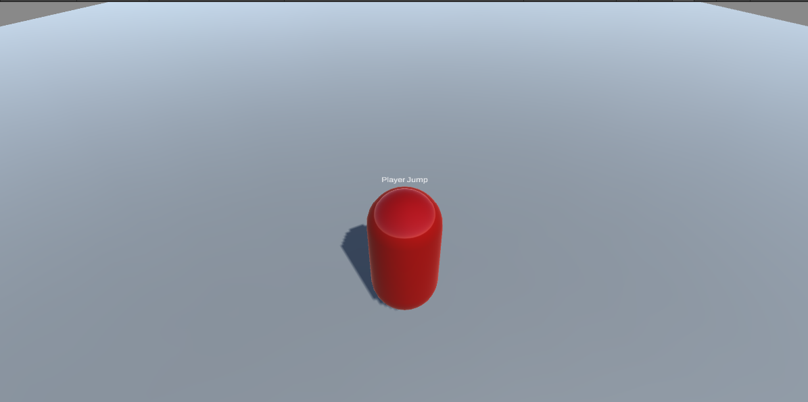

# TD Unity 3D
Au cours de ce TD, nous allons apprendre a manipuler les concepts de base de Unity.  
L'objectif final est de créer une petit jeu très simple.  
Nous déplacerons notre joueur (qui sera une capsule), de diverses manières au cours du TD.  
Le niveau contiendra d'autres objets (des cubes), qui se déplaceront tout droit vers le joueur.  
En cas de collision avec ce dernier, la scène se rechargera intégralement (pour simuler un Game Over).  
Le joueur pourra se défendre en cliquant sur l'écran, ce qui fera apparaitre un FX de dégâts, permettant de faire disparaitre les cubes.  
Vous trouverez dans le dossier Build différentes builds du résultat attendu.

## 1. Préparer la scène
Notre scène contiendra plusieurs éléments: 
- Un **plan**, qui représentera le sol. Vous pouvez lui donner une scale de 5 sur chaque axe.
- Un **player**, représenté par un Cylindre. 
- Une **Caméra**, situé derrière le player, de manière à voir le sol et le player
- Une **lumière**, qui éclairera notre scène (la lumière de base convenant très bien).

Voici le genre de résultat attendu:  
 

## 2. Lire les inputs
Comme vu lors du cours, il existe deux manières de lire les inputs dans Unity.  
Nous allons utiliser les deux, pour comprendre un peu leurs différences. 
### 2.1  Old Input System (InputManager)
Vous allez devoir créer deux scripts:
- Un script lisant les inputs depuis les deux **axes**: Horizontal & Vertical
- Un script lisant les inputs depuis les **flèches du clavier (ou ZQSD)** selon vos préférences

#### 2.1.1 Lecture des axes
Pour lires les inputs depuis les axes, vous allez devoir utiliser les fonctions **[Input.GetAxis(axisName)](https://docs.unity3d.com/ScriptReference/Input.GetAxis.html)**.  
Ces fonctions permettent de récupérer une valeur comprise entre **[-1, 1]**.

**Consigne :** Créer un script, nommé **MovePositionByAxis**. Lisez les inputs d'axes, et déplacer l'objet du script en conséquence en fonction d'une vitesse exposée en paramètre du script.  
Attachez le à un gameobject de Player (un cylindre), et testez. 

*Hint: Pour déplacer un objet, vous pouvez vous placer dans la méthode **Update** et toucher à transform.position. Pensez à bien utiliser **Time.deltaTime** pour avoir une vitesse constante à toute les frames.*

#### 2.1.2 Lecture des boutons
Pour lire les inputs de boutons, vous allez devoir utiliser les fonctions **Input.GetKeyDown(key), Input.GetKey(key) ou encore Input.GetKeyUp(key). [(doc)](https://docs.unity3d.com/ScriptReference/Input.GetKeyDown.html)**  
La valeur retournée est un bool, qui sera vrai si jamais la touche est appuyé au moment donné: 
- **Down** => début d'appui
- **Key** => Appui constant 
- **Up** => Relachement de l'appui

**Consigne:** Créer un script, nommé **MovePositionByKeys**. Le script sera identique a **MovePositionByAxis**, mais lira les inputs depuis les flèches (ou ZQSD).
*Hint: Vous pouvez accéder au keys via l'enum [KeyCode](https://docs.unity3d.com/ScriptReference/KeyCode.html).*


### 2.2 New Input System (Unity InputSystem)
Pour cette partie, vous allez devoir déclarer des inputs dans l'asset **PlayerInputs** présente dans le dossier *Assets/Inputs* du projet.  
**Consigne:** Rajouter les inputs nécéssaire dans l'asset d'inputs. Créer un script **MovePositionByNewInputSystem**, qui exposera une variable **InputActionReference**, et **speed**.  
A l'Update, lire les inputs sous forme de **Vector2** depuis la variable exposée. Faire bouger l'objet du script de la même manière que précédemment.

## 3. Déplacement physique
Dans les parties précédentes, nous avons vu comment déplacer un objet via les inputs.  
Or cet objet n'était soumis à aucune physique, ce qui était plutôt pratique pour notre exemple, mais peu réaliste.  
Nous allons rajouter de la physique à notre objet, et le déplacer d'une manière différente. 

**Consigne:** Créer un script, nommé **MoveByVelocity**. Le script exposera une variable speed, et devra écouter les inputs de la manière que vous souhaitez vu précédemment.  
Il devra également exposer une variable de type **Rigidbody** pour pouvoir accéder au composant physique de l'objet.  
A l'Update, vous devrez settez la vélocité de l'objet, pour qu'il puisse se déplacer.
*Hint: Si votre objet bouge dans tout les sens, vous pouvez peut-être essayer de jouer avec les contraintes du rigidbody, comme ci-dessous.**  


## 4. Sautons ! 
Maintenant que nous bougeons correctement sur l'axe X et Z, il est temps de bouger en hauteur, sur l'axe Y.  
Pour celà, nous allons lire un nouvel input, qui sera de type **Button**. Cet input nous permettra de sauter.

**Consigne :** Créer un script nommé **JumpBehaviour**, qui sera responsable du saut de l'objet. Ce script devra écouter l'input de saut que nous venons de créer, et appliquer une force au rigidbody.  

*Hint: Vous pouvez utiliser la méthode [Rigidbody.AddForce(float power)](https://docs.unity3d.com/ScriptReference/Rigidbody.AddForce.html). N'hésitez pas a mettre une force élevée (> 200).*


## 5. Instanciation d'objets
Pour avoir un peu plus d'interaction, nous allons faire apparaitre un Cube, lorsque le joueur décide d'appuyer sur son clic souris.  
Vous allez devoir créer un nouvel input, qui écoutera le click de la souris à l'écran.  
Une fois que nous avons reçu l'input, il faudra dans notre script convertir la position de la souris en une position sur notre sol. Penchez vous du côté des Raycast.  
Vous pouvez créer un prefab **Cube**, contenant un cube avec un Collider. Pour le moment, ne mettez pas de rigidbody.

**Consigne :** Créer un script nommé **SpawnCubeOnMouseClick**. L'assigner a n'importe quel objet de la scène (le player, c'est mieux).  
Ecoutez l'input de la souris, puis instancier un cube au niveau du sol. 

*Hint: Input.mousePosition vous donnera la position de la souris a l'écran. GameObject.Instantiate(object) vous permettra d'instancier un objet dans la scène. Attention, c'est mieux si cet objet est un prefab.**


## 6. Les collisions
Jusqu'ici, les seules collisions présentes dans notre scène étaient les collisions entre notre player et le sol.  
Nous allons voir les deux types de collisions: les collisions classique bloquantes, et les triggers. 

### 6.1 Les collisions classiques
Notre player collisionne actuellement avec les cubes que nous faisons apparaitre, l'empechant d'avancer.  
Nous allons créer un script, nommé **DestroyCubeOnCollide**, qui détruira tout les cubes avec lesquels nous collisionnons.  
Vous pouvez utiliser les **tags**, et flagger tout objet cube avec le tag *cube*.  
Pour détruire un objet, vous pouvez appeler la fonction **Destroy()**.


### 6.2 Les triggers
Les triggers sont des boites de collisions, que tout élément physique peut traverser.  
Cependant, elles émettent un évènement lorsque un objet entre en contact avec elles.
Notre object va être de créer un trigger qui fait disparaitre **tout les cubes** de la scène.  
Pour celà, vous pouvez créer un objet vide dans la scène, et lui assigner un composant **BoxCollider**. Réglez le comme bon vous semble, et placer le où vous voulez. 

**Consigne:** Créer un script **DestroyAllCubesOnTrigger**, qui détruira tout les cubes lorsque le player rentre dans le trigger. 
*Hint: Il existe différentes fonctions permettant de récupérer les objets dans la scène. N'hésitez pas a fouiller la [documentation](https://docs.unity3d.com/ScriptReference/GameObject.html).*


## 7. La caméra
Maintenant que notre joueur peut avoir différentes incidences sur le jeu, nous voulons que la caméra puisse nous permettre d'aller où nous voulons.  
Pour celà, nous allons voir différentes manières de **suivre le joueur** avec la caméra.

### 7.1 Script CameraFollow
Une solution brute force pour suivre le joueur consiste à mettre la caméra **en enfant** de notre player. Cependant, cette méthode entraîne des tas de problèmes, nous n'allons donc pas la faire (mais vous pouvez essayer, pour comprendre le fonctionnement).
Nous allons d'abord créer un script nommé **CameraFollow**. Ce script devra effectuer un traitement pour **suivre le joueur**.  
Ce script devra récupérer une référence vers le player lors de son **Start**.  
La caméra devra se tenir à une distance que nous aurons spécifié dans le script (sous forme de Vector3). 


### 7.2 Cinemachine
[Cinemachine](https://docs.unity3d.com/Packages/com.unity.cinemachine@2.3/manual/index.html) est un package embarquant beaucoup d'outils pour améliorer notre Caméra ingame.  
Pour plus de simplicité, nous allons utiliser ce package pour pouvoir avoir une belle caméra. 

Dans votre scène, créez un objet **VirtualCamera**. Cette caméra sera la caméra par défaut maintenant utilisé dans notre scène.  
Naviguez parmi les différents réglages pour essayer de créer une caméra suivant le joueur.


## 8. Changeons nos inputs pour s'adapter au format mobile

### 8.1 Le déplacement
Vous trouverez dans le projet un prefab de Joystick *(\Assets\Joystick Pack\Prefabs)*, permettant d'afficher un joystick sur notre écran.  
Les joystick sont des moyens simple de permettre à l'utilisateur de faire un déplacement dans les jeux mobiles.  
Prenez le **FixedJoystick**, et placer le dans un **Canvas** au sein de votre scène. Placez le où vous souhaitez.  
Ensuite, il faut adapter notre script de déplacement pour se déplacer avec le joystick plutôt qu'avec les inputs claviers.  
Pour celà, nous devons accéder a la variable **Direction** du joystick. Le reste du comportement de déplacement reste le même.


### 8.2 Le click souris
Maintenant que nous avons notre jostick, nous avons une problématique supplémentaire: comment pouvoir à la fois écouter les inputs sur le joystick, mais également les inputs d'une touche d'écran pour poser un cube ?

Pour celà, nous allons utiliser l'API [EnhancedTouch](https://docs.unity3d.com/Packages/com.unity.inputsystem@1.0/api/UnityEngine.InputSystem.EnhancedTouch.html) de InputSystem.  

Pour l'activer:
```cs
public void OnEnable()
{
	EnhancedTouch.TouchSimulation.Enable();
	EnhancedTouch.EnhancedTouchSupport.Enable();
}

public void OnDisable()
{
        EnhancedTouch.Touch.onFingerDown -= OnFingerDown;
        EnhancedTouch.TouchSimulation.Disable();
}
```

Ensuite, nous pouvons écouter l'évènement suivant pour chaque appui sur l'écran:

```cs
private void OnEnable()
{
    EnhancedTouch.Touch.onFingerDown += OnFingerDown;
}

private void OnFingerDown(EnhancedTouch.Finger finger)
{
}
```

Voici ce que doit faire notre script posant des cubes: 
- Vérifier si le tap actuel n'est pas sur le joystick
	- Si oui => Ne rien faire.
	- Si non => Instancier un cube. 

## 8. Ennemis
Pour pimenter un peu notre jeu, nous allons ajouter des ennemis.  
Ces derniers seront des cubes, d'une couleur différente des cubes que le joueur peut poser.  
Nous créerons un script nommé **Enemy**, et nous voulons que chaque ennemi se dirige vers le player, peu importe sa position.  
Lorsqu'un ennemi collide avec le player, nous voulons que le jeu se recharge.  
Pour celà, jetez un oeil au [scène management d'Unity](https://docs.unity3d.com/ScriptReference/SceneManagement.SceneManager.html). 


## 9. Faisons apparaitre nos ennemis
Maintenant que nos ennemis sont fonctionnels, nous voulons que ces derniers apparaissent de manière aléatoire sur notre sol.  
Pour celà, nous allons créer un script nommé **EnemySpawner**. Ce script prendra en paramètre une **BoxCollider**, réglé sous forme de trigger, qui sera la zone d'apparition des ennemis. Les ennemis peuvent spawner partout dans cette box.  
Le second paramètre sera **la distance minimale avec le joueur**. Pour des raisons évidentes de jouabilité, nous ne voulons pas que nos ennemis apparaissent sur notre joueur.  
Le dernier paramètre sera **une plage de spawn**. Nous pouvons utiliser un *Vector2*. Elle représentera l'intervale de temps minimum et maximum entre l'apparition de chaque ennemi.

Notre script devra faire apparaitre des ennemis en boucle sur la carte, dans une position aléatoire de la box, et dans un timing aléatoire également.

*Hint: Vous pouvez utiliser les coroutines.**


## 10. Tuons nos ennemis
Maintenant qu'une horde d'ennemis se dirige vers nous, il nous faut la possibilité de nous défendre.  
Nous allons créer un projectile qui va tuer les ennemis.  
Pour celà, vous pouvez créer un prefab variant d'un des impacts situés dans *\Assets\Inguz Media Studio\Free 2D Impact FX\Prefabs*.  
Nous allons assigner un **Sphere collider**, qui sera un trigger à cet objet.  
A chaque fois qu'un cube rentre dans notre trigger, nous allons détruire le cube.  
Pour celà, créer un script nommé **PlayerHit**, et effectuer le traitement nécéssaire a l'intérieur.
Ultimement, nous voulons que cet objet se détruise après peu de temps (un temps défini par vous). 


## Pour aller plus loin... 

Vous pouvez améliorer le jeu de pleins de différentes manières (d'un point de vue du gameplay):
- Chaque ennemi peut avoir une vitesse aléatoire (situé dans une plage)
- Limitez les actions du joueur (avoir un cooldown sur l'utilisation de l'impact)
- Ajouter un compteur d'ennemis tués

A vous d'être créatifs ! 

Happy Hacking !
